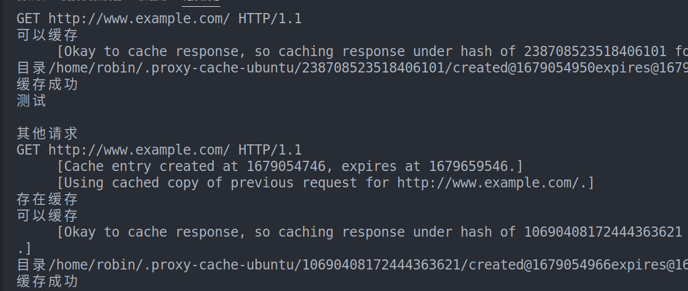
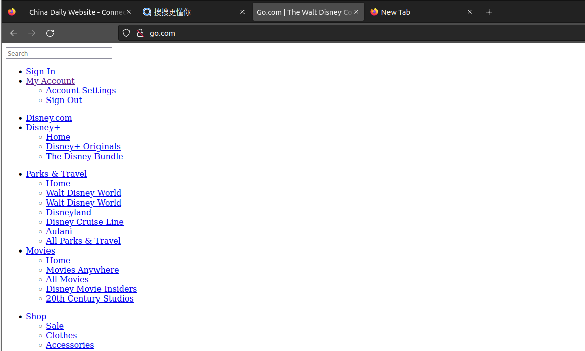
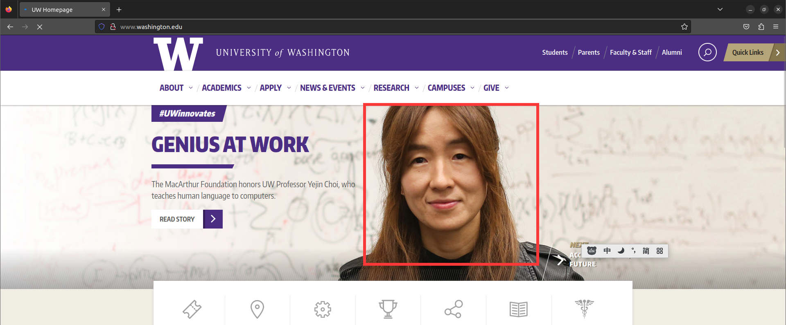
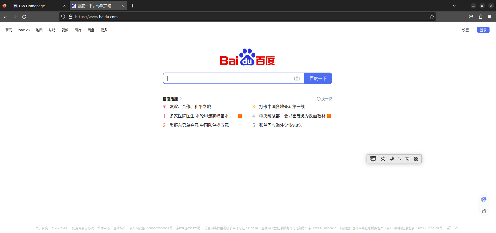
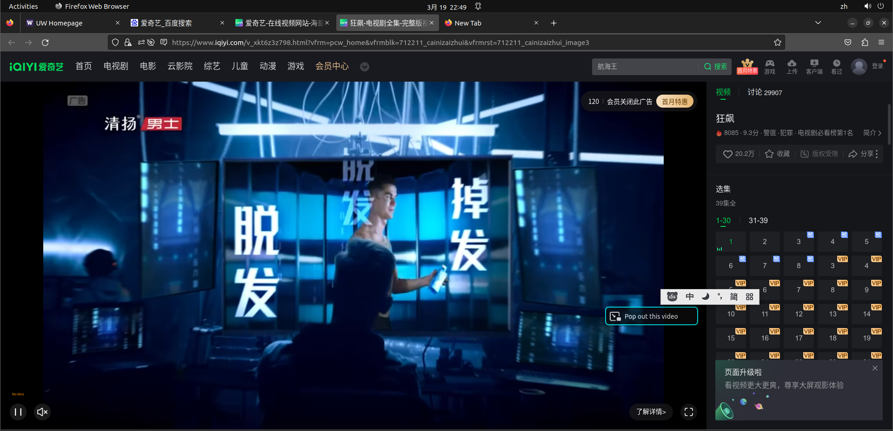
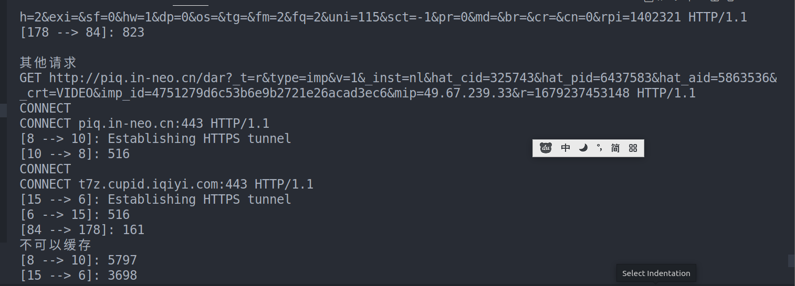

#### 任务1

分类设计
得到class图

#### 
  1、出错原因找到
    - 对域名解析错误。
    - 在request ingestRequestLine方法中


#### 自定义的异常
对于需要自己定义异常的时候，可以使用以下的方式，
```c++
class HTTPProxyException: public std::exception {
  public:
    HTTPProxyException() throw() {}

    HTTPProxyException(const std::string& message) throw() : message(message) {}

    const char *what() const throw() { return message.c_str(); }
  protected:
    std::string message;
};
```

这里定义了两张构造方法，都需要抛出异常

- 无参构造

- 以错误信息为参数的构造方法

- 重构了what函数，返回自己的错误信息。

- 其中message用来保存不同错误的引发原因.

之后可以让其他基本的类继承这个函数

```c++
class HTTPBadRequestException: public HTTPProxyException {
  public:
    HTTPBadRequestException() throw() {}
    HTTPBadRequestException(const std::string& message) throw() : HTTPProxyException(message) {}
};
```

#### 已基本实现

如有需要可以以后添加额外的功能


#### 问题记录

##### 问题1:用http网站的一些图片资源无法获取

原因这些图片是以超链接的形式出现的，但是这种图片用的是https协议


这是无法显示的图盘的标签
```html
<div class="uw-hero-image uw-homepage-slider slide-31 darktext darktextmobile slide-order-0" data-id="31" style="background: url(&quot;https://uw-s3-cdn.s3.us-west-2.amazonaws.com/wp-content/uploads/sites/81/2023/03/10165533/03-11-22-macarthur-genius-desktopF.jpg&quot;) center center / cover no-repeat transparent;"><div class="mobile-image" style="background-image:url('https://uw-s3-cdn.s3.us-west-2.amazonaws.com/wp-content/uploads/sites/81/2023/03/10165553/03-11-22-macarthur-genius-mobileB.jpg')"></div></div>
```

当前的代理还无法支持这种形式的数据，所以出现了错误

解决方案：

目前无法实现，估计需要支持https以后才能解决


#### 里程碑2


##### 黑名单
实现依靠c++中的regex类

这个类的使用需要我们知道正则表达式怎么书写

这里有一个有趣的[正则练习网站](https://regexlearn.com/zh-cn/learn/regex101)
这是一个简单的[正则练习的网站](https://tool.oschina.net/regex/)


简单的说明
这是简单的网站黑名单的例子

匹配黑名单网站的正则表达式写在blocked-domains.txt文件中
```python
(.*)\.microsoft.com(.*)#匹配所有含有microsoft.com的url
```

()：是正则中的分组
.*:表示匹配任意的字符串


##### cache 设计（单线程版）


主要需要三个方法

1、检查当前的请求和回应是否应该cache？shouldCache
```c++
  return maxAge != 0 && //这是用来设置缓存时间的变量
  request.getMethod() == "GET" && 
  response.getResponseCode() == 200 && 
  //上面两句表示我们只应该缓存成功GET的请求和他的回应
  response.permitsCaching();
  //上面的是检查服务器的请求是这个数据保是否可以缓存
```


2、当前是否有这个缓存？containsCacheEntry 

缓存以文件的形式存在服务器上

我们可以用二进制的方式打开文件，然后利用response的序列化功能得到所有的信息。


3、将当前的请求和回应添加到缓存中 cacheEntry

补充在http回应response中如果当前的数据头可以被缓存的话(存在"Cache-Control")，
请求中会有一个"max-age="属性，这个属性标注了这个缓存可以存在的时间。


检查控制台太麻烦，可以用一个


##### 错误记录，客户端放弃请求

客户端关闭了连接，这里出现了一个错误
每次出现可以缓存的时候，都
会引发一个客户端关闭连接错误
这样会造成一些严重的错误

我怀疑是因为在cache请求和回应的时候花费了太多的时间，
导致超时客户端关闭了链接，
所以尝试在回应了客户端之后在将内容记入缓存中




我也不知道为什么好像中文网站会出错，但是英文网站不会

测试缓存时需要把浏览器自己的缓存关闭，要不然浏览器自己都有缓存，不会
向服务器发送请求


#### 多线程版本

这是效果演示
  


使用线程池来实现多线程

其中线程池是通过信号量加conditional_variable的方式实现的，

有一个调度器

维持一个任务队列和工人队列

任务分为三个状态，待完成，完成中，完成

工人也有两个状态 工作中和空闲中

如果任务队列中有任务待完成，并且工人队列中有空闲工人，调度器就通知工人完成该任务，并将此任务从任务队列中剔除，工人也标记为工作中

有新任务时需要添加到任务队列中，通知调度器有新任务

如果有工人完成任务了，也需要通知调度器，有空闲工人了

关键代码
```c++
      while(true)
      {
        worker_task[i].hasTask.wait();

        terminate.end_m.lock();
        if(terminate.end) 
        {
          // cout << i << "退出" << endl;
          terminate.end_m.unlock();
          break;
        }
        terminate.end_m.unlock();
        //执行任务
        // cout << i << "开始执行" << endl;
        //cout << worker_task[i].task.size() << endl;
        worker_task[i].task_m.lock();
        auto mytask  = worker_task[i].task;
        worker_task[i].task_m.unlock();
        mytask();
        //通知调度我有空了
        wo_a_sh.add_workers_m.lock();
        wo_a_sh.workers.push(i);
        wo_a_sh.add_workers_m.unlock();
        wo_a_sh.freeworkers.signal();
        finish_tasks_m.lock();
        ++finish_tasks;
        finish_tasks_m.unlock();
        finish_tasks_s.notify_all();
      }
```


这是使用线程池的代码
```c++
ThreadPool threadpool(64);
  threadpool.schedule([this,clientfd,clientIPAddress](){
    requestHandler.serviceRequest(make_pair(clientfd, clientIPAddress));
  });
```


使用多线程时需要注意，这里的cache作为多个线程共同使用的资源，要避免出现race condition，

这里的做法是使用多个锁，997个(这是一个素数)

然后将每个请求hash到对应的哈希值hashNum，然后将hashNum%997.通常素数搭配哈希使用时效果会更加好。


然后再请求资源时，需要先请求对应的锁

``` c++
//将请求转化成哈希值
  size_t HTTPCache::hashRequest(const HTTPRequest& request) const {
  hash<string> hasher;
  return hasher(serializeRequest(request));  
  }

//将请求转化成哈希值
  string HTTPCache::hashRequestAsString(const HTTPRequest& request) const {
  ostringstream oss;
  oss << hashRequest(request);
  return oss.str();
  }

  string requestHash = hashRequestAsString(request);
  
  size_t locksNum = convertToNum(requestHash)%997;

  lock_guard<mutex> lg(cacheLocks[locksNum]);
```

#### 对https(CONNECT的支持)

对https的支持有一点麻烦，使用https协议的两方

需要客户端的一方先把发起链接请求
然后服务器回应，之后服务器确认发送一个
200 
确认，没有payload,
之后两者之间建立了一个全双工的链接，之后发送的信息是经过加密的

我用文件流来模拟这个过程
将服务端发送的请求全都转发给客户端


这是效果，之前不可以获取图片的页面现在也可以加载图片了



之前无法访问百度现在也可以访问了




视频也是可以播放的



这是后台的输出，我做的一个简单的日志
